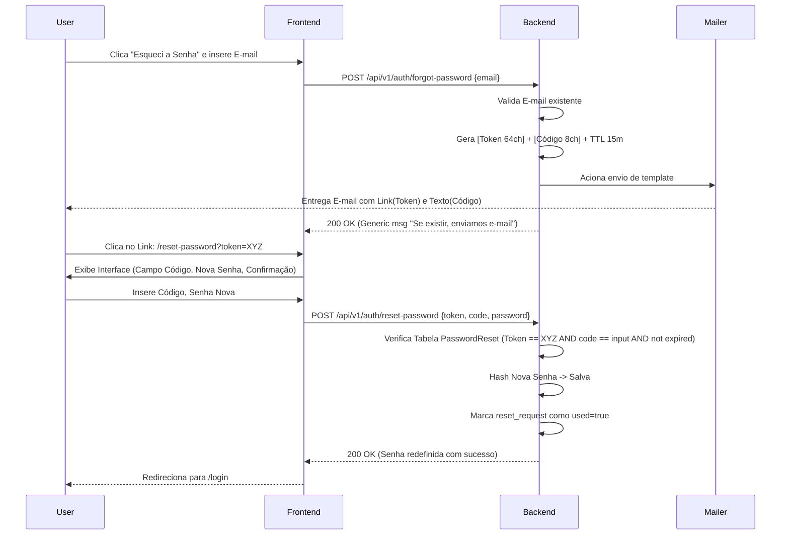

# Design e Arquitetura do Sistema (docsv2/design.md)

Este documento detalha exaustivamente a estrutura técnica, os padrões de projeto, e as lógicas arquiteturais aplicadas nas refatorações da plataforma Pixelcraft Studio (Fase 2). O objetivo é fornecer uma visão granular para que as equipes de Frontend e Backend implementem o serviço com excelência e sem falhas de integração.

---

## 1. Fluxo de Autenticação Segura: Redefinição de Senha (Password Reset Process)

### Contexto e Problema
O fluxo antigo resetava a senha sumariamente e enviava a nova em texto claro via e-mail. Isso contraria práticas básicas de segurança da informação (OWASP), deixando o usuário vulnerável à interceptação (Man-in-the-Middle ou comprometimento do provedor de e-mail) e negação de serviço (mudança de senha sem pedir).

### Arquitetura da Solução Proposeda

#### A. Entidade "PasswordReset" (Backend)
Será criada uma tabela auxiliar no banco de dados para rastrear tentativas de reset.
- `id` (UUID, Primary Key)
- `user_id` (UUID, Foreign Key)
- `token` (String Hash longo, 64-char) - Enviado no link.
- `validation_code` (String, 8 caracteres uppercase alfanumérico) - Enviado dentro do texto do e-mail.
- `expires_at` (Timestamp) - TTL de 15 a 30 minutos máximo.
- `used` (Boolean) - Se foi consumido (prevenir replay attacks).

#### B. Mecanismo de Dupla Validação (2FA-like Flow)
A arquitetura se apoia na premissa de que *ter o link não é suficiente*. 
O link é o **Vetor de Roteamento** (aponta o app para o estado correto de reset).
O código é o **Vetor de Autorização** (garante leitura ativa do conteúdo do e-mail, mitigando varreduras automáticas de links).

#### C. Diagrama de Estados do Fluxo

---

## 2. Controle de Acesso Granular (Sub-permissões & CPF)

### Contexto e Problema
A plataforma lida com dados financeiros e identificação oficial (CPF). O objeto de permissão genérico (`action: "view", resource: "users"`) concede poder total ou nulo. É necessário restringir visualizaçõo de CPFs exclusivamente à roles administrativas estritas, removendo essa capacidade de "Suportes Departamentais" ou "Moderadores Gerais".

### Arquitetura da Solução
**Design Pattern:** Attribute-Based Access Control (ABAC) disfarçado em Role-Based (RBAC) expandido.
A matriz de ações em cima do recurso `users` passa de CRUD para CRUD++.

*Novas Ações Disponíveis para Recursos 'Users':*
- `view`: Lista básica de users (Nome, Email oculto parcialmente, Ranks).
- `view_sensitive`: Permite ver E-mail integral e Endereços.
- `view_cpf`: Acesso explícito ao CPF.
- `view_financial`: Acesso à visualização de saldos da Wallet do usuário (Painel Admin).

**Controle de Fronteira Dupla (Zero-Trust API):**
1. **Frontend Masking:** A UI nunca exibirá colunas se a verificação local `usePermissions().hasAction('users', 'view_cpf')` falhar.
2. **Backend Masking (Crucial):** A resposta da API `GET /api/v1/admin/users/:id` **OMITIRÁ** as chaves JSON (enviando `null` ou retendo a chave `cpf` do dicionário final) baseado na permissão do Admin requisitante lido do Token JWT no Middleware.

---

## 3. Dinâmica Financeira e Históricos (Pix Pipeline)

### Contexto e Problema
Há uma dependência do frontend atual em atestar sucesso de depósitos Pix através de pooling cego (ficar olhando a API até o saldo ser maior do que era antes). Isso falha se: O usuário recarregar a página, fechar a aba, ou ganhar bônus simultaneamente.

### Arquitetura da Solução: The Async Pipeline
O Frontend deve atuar como cliente Event-Driven para feedback de UX, deixando a responsabilidade transacional primária para Webhooks e Polling via Status explícito do recurso.

**Fluxograma:**
1. O usuário gera a cobrança Pix no client.
2. O Backend chama a Gateway (Ex: Banco Central/EFI) e registra na tabela `transactions` o registro `STATUS: PENDING`.
3. O Frontend recebe o `QR Code` e o `Transaction_ID`.
4. O Frontend fará Polling no GET `/api/v1/wallet/transactions/{Transaction_ID}/status`. O Backend responde o status.
5. Em background o webhook do Payment Provider dispara POST para nosso painel `webhook/pix`. O Backend valida a assinatura, altera a Transação para `COMPLETED` e soma o saldo (Transaction ACID).
6. O Polling do frontend capta `COMPLETED` na próxima rodada e exibe o "Verificado" na UI.

---

## 4. Fixação de Extensão de Arquivos em Downloads

### O Problema Tecnico (Content-Disposition Parsing)
O padrão HTTP `Content-Disposition: attachment; filename="..."` é falho quando os browsers ou frameworks omitem as aspas, ou utilizam caracteres UTF-8 codificados (ex: `filename*=UTF-8''nome_arquivo.zip`). A Regex nativa utilizada pelo Front em `Downloads.jsx` falha silenciosamente caso as aspas faltem, caindo no fallback padrão ignorando a stream data file type.

### Modelagem da Resolução:
O Frontend implementará a extração multi-estágio do header via Expressões Regulares robustas ou biblioteca específica (ex: content-disposition-decoder), testando três cenários em cascata:
1. Padrão RFC 5987 (`filename*=` com suporte a encodings, fallback máximo).
2. Padrão Clássico (`filename="xyz"`).
3. Padrão Loose (sem aspas `filename=xyz.zip`).

*Contrato de Sincronia:* Mesmo assim, a responsabilidade original reside no Backend em montar rigorosamente a string exata em todas as instâncias de blob servidas. O Frontend confiará preferencialmente aos metadados do `Blob` type se tudo mais falhar (MIME sniff).
